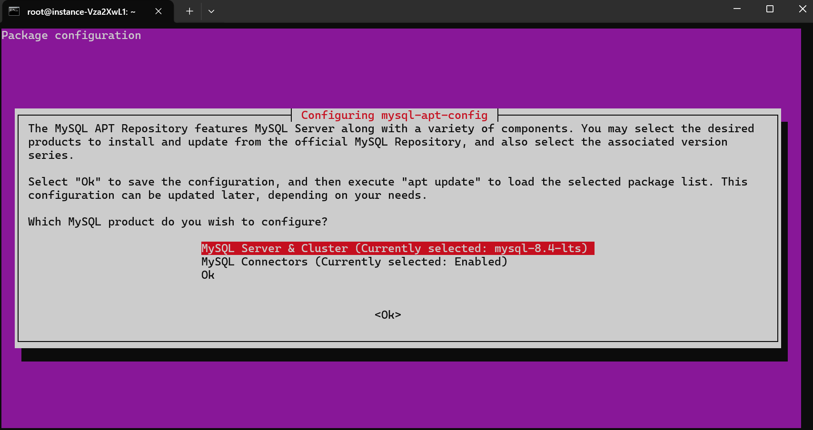
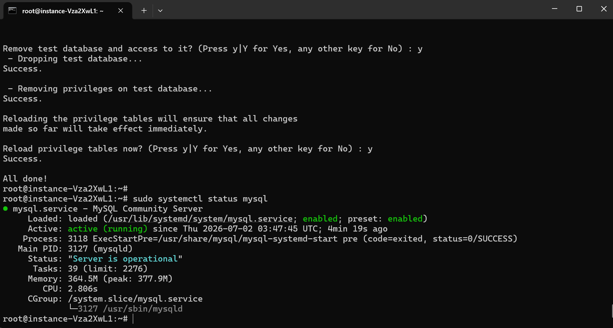
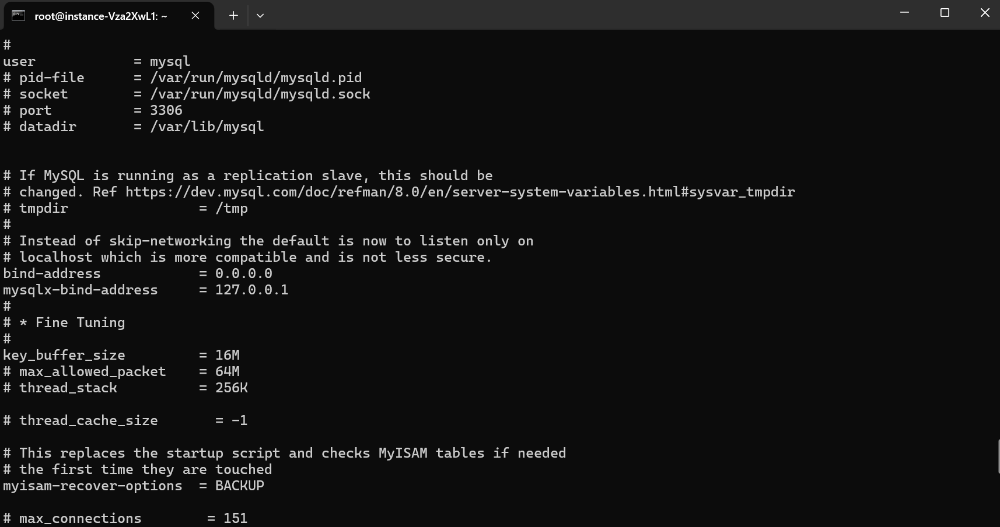

# 操作指南

## 第一步：准备MySQL
1. 首先部署好MySQL数据库(8.0及以上版本)这里以Ubuntu 24.04 LTS为例，链接至您的服务器，执行`sudo apt update`，然后执行`wget https://dev.mysql.com/get/mysql-apt-config_0.8.32-1_all.deb`
```bash
sudo apt update
wget https://dev.mysql.com/get/mysql-apt-config_0.8.32-1_all.deb
```
windows安装可以参考：https://blog.csdn.net/weixin_45896437/article/details/132030152
2. 执行`sudo dpkg -i mysql-apt-config_0.8.32-1_all.deb`后您将看到以下画面
   
```bash
sudo dpkg -i mysql-apt-config_0.8.32-1_all.deb
```
如果要调整安装版本选择MySQL Server & Cluster,我这里保持默认直接选择Ok
3. 执行`sudo apt update`更新仓库,在执行`sudo apt install mysql-server -y`安装MySQL Server
```bash
sudo apt update
sudo apt install mysql-server -y
```
4. 待安装完成后配置安全配置，执行:
```bash
sudo mysql_secure_installation
```
以下为我的设置:
```MySQL Security Settings
VALIDATE PASSWORD COMPONENT：是否启用密码强度验证？y

密码强度等级：2

Remove anonymous users?y（删除匿名用户）

Disallow root login remotely?y（禁止远程 root 登录，更安全）

Remove test database and access to it?y（删除测试库）

Reload privilege tables now?y（立即生效）
```
5. 检查是否安装完成,执行:
```bash
sudo systemctl status mysql
```

6. 创建数据库与访问用户(这里为了方便我允许所有ip访问了)，
执行
```bash
sudo mysql -u root -p
```
默认直接回车就可以了,然后执行：
```bash
CREATE DATABASE IF NOT EXISTS arknights;
CREATE USER 'ark'@'%' IDENTIFIED BY '你的密码';
GRANT ALL PRIVILEGES ON arknights.* TO 'ark'@'%';
FLUSH PRIVILEGES;
EXIT;
```
执行
```bash
sudo nano /etc/mysql/mysql.conf.d/mysqld.cnf
```
来修改MySQL配置允许外部访问(如果只在本地访问无需修改)

在执行
```bash
# 4. 重启 MySQL
sudo systemctl restart mysql

# 5. 开放防火墙（如果启用）
sudo ufw allow 3306/tcp
```

## 第二步修改.json文件
解压你下载的文件，找到`config.json`编辑它找到文件内的以下内容:
```json
"database":{
		"host":"",
		"port":3306,
		"dbname":"arknights",
		"user":"ark",
		"password":"",
		"extra":"useSSL=false&useUnicode=true&characterEncoding=utf-8&autoReconnect=true&allowMultiQueries=true&allowPublicKeyRetrieval=true&serverTimezone=Asia/Shanghai"
	}
```
修改host为你的MySQL服务器IP或域名，修改password为你设置的密码,保存它

## 最后启动服务的
```bash
java -jar hypergryph-1.9.3.jar
```
